# Summer CS Hardware Intensive

## Info Session

Ian Heraty
<ihera2@uillinois.edu>

---

# Welcome 👋

- 7-day summer intensive
- Focus: **Computer Hardware + Electronics**
- Designed for **high school**
- Hands-on, project-based learning

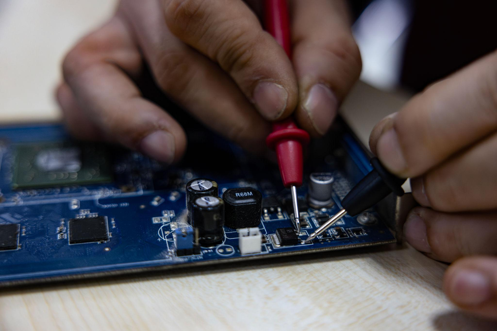

---

# Quick Question

## What do you hope to get out of this intensive?

- Learn electronics fundamentals?
- Build confidence with hardware?
- Bring projects into your classroom?
- Something else?

---

# Instructor

- Hi, my name is Ian Heraty
- I am a software developer and electronics hobbyist

---

# Teaching Assistant

- An Luu
- UIC Electrical Engineering undergraduate assistant
- Enjoys swimming, jogging, and playing board games

---

# Structure of Each Day

**Morning (8:30 – 12:00)**
*Co-learning with students*

- Lecture
- Hands-on labs

**Lunch (12:00 – 1:00)**

**Afternoon (1:00 – 2:00)**
*Educators*

- Reflection + pedagogy
- Adapting for your classroom

---

# Locations

## Main

Discovery Partners Institute
200 S Wacker Dr
Chicago, IL 60606

## 1 Day Workshop

UIC
Women in Engineering Programs (WIEP) Lounge
SELE 2260
842 W Taylor St
Chicago, IL 60607

---

# Pedagogical Approach

- Learning by **discovery**
- Build intuition through **hands-on projects**

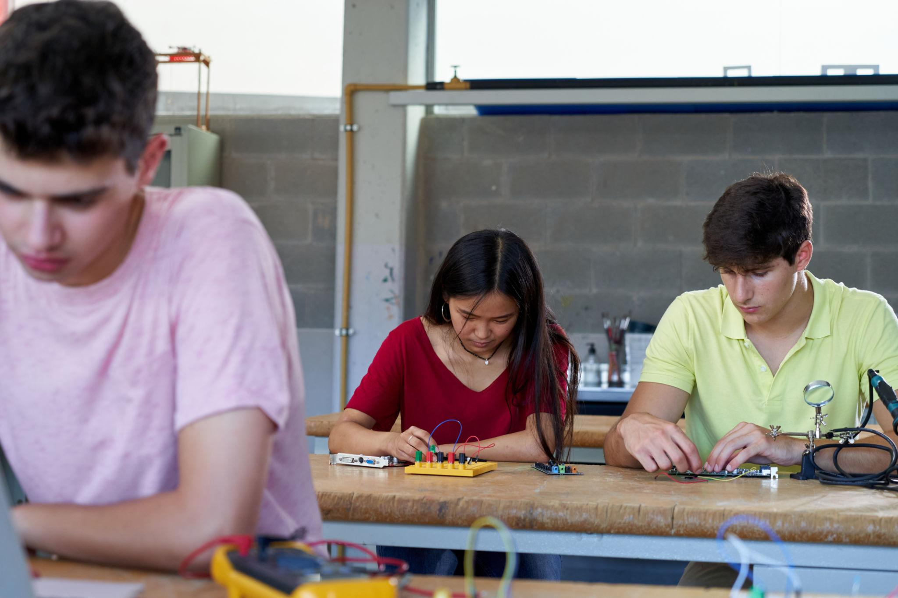

---

# Core Goal

> Bootstrapping students (and teachers) with hardware knowledge from **Ohm's Law → Microcontrollers → Full Projects**

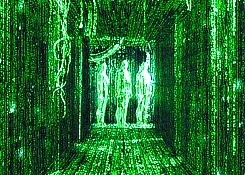

---

# Why Hardware?

- Growing importance in STEM
- Bridges:
  - Computer Science
  - Electrical Engineering
  - Computer Engineering
  - Physics

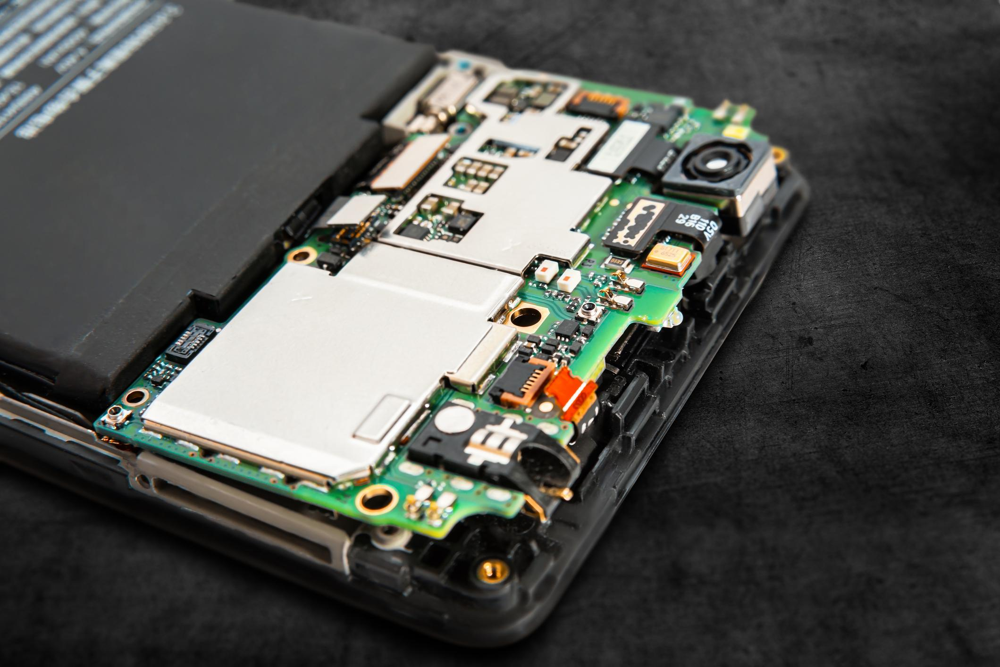

---

# Why Now?

- **The shift is happening:** Software → **Software + Hardware**
- AI writes code → but struggles with the physical world
- Hardware is becoming a bottleneck

---

> "Over the next 25 years, most of the money will be made in hardware"
>
> - Shaun Maguire, Partner, Sequoia
> [Source](https://x.com/tbpn/status/2042981124641820943?s=20)

---

> "The biggest beneficiaries of vibecoding are going to be the shape rotators, not the wordcels."
> — Palmer Luckey, Founder, Oculus + Anduril
> [Source](https://x.com/a16z/status/2026348550477722020?s=20)

---

# What hardware gives you as an *educator*

- Deeper intuition (how systems actually work)  
- Tangible results (light, sound, motion)  
- Engaging learning for students
- Practical life skills

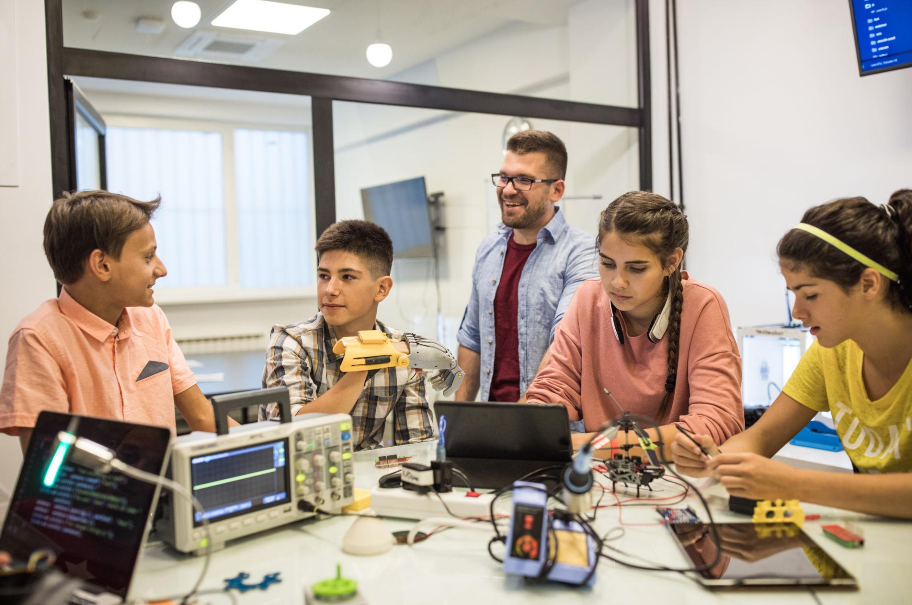

---

# Will it be difficult?

- Assume you're beginning with no prior knowledge
- Theory kept to a minimum
- Only math you'll need will be addition, subtraction, multiplication, and division

---

# Learning Goals

- Ohm's Law
- Breadboards & circuits
- Measuring voltage, current, resistance, and continuity
- Microcontrollers (Micro:bit + Arduino)
- Soldering

---

<!-- # Components You'll Learn

- Resistors
- Capacitors
- Diodes
- Potentiometers
- Transistors

---

# Systems & Concepts

- Logic & Binary
- 555 Timer
- Decade Counters
- Signals & pulses

---

# Tools & Skills

- Microcontrollers
- Soldering
- CAD / 3D Design
- Bill of Materials (BOM)

---

# Equipment You'll Use

- Multimeter
- Breadboard
- Jumper wires
- Resistors, capacitors
- Switches, buttons
- Micro:bit
- Soldering iron

---

# Example Projects

- LED brightness control
- Variable resistance circuit
- LED delay + fade (RC circuit)
- Transistor toggle switch
- Multivibrator circuit
- 555 timer circuits

--- -->

<!-- # Weekly Schedule Overview -->

# Day 1 (6/23)

## Measure

- Ohm's Law
- Using a multimeter
- Breadboard
- Resistor LED Circuit
- Buttons & switches

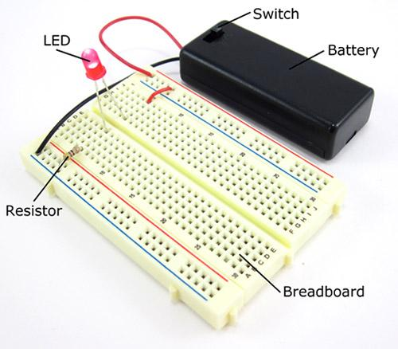

---

# Day 2 (6/24)

## Flow

- Transistors
- Logic gates

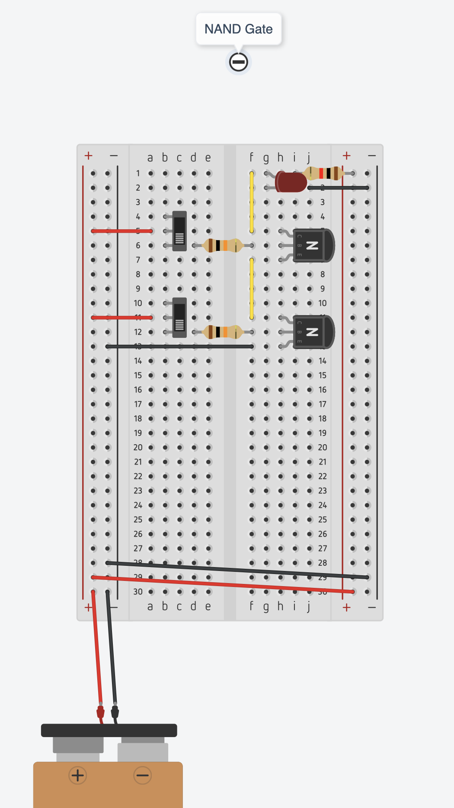

---

# Day 3 (6/25)

## Time

- Capacitors
- RC circuits
- LED delay + fade
- Multivibrator circuit

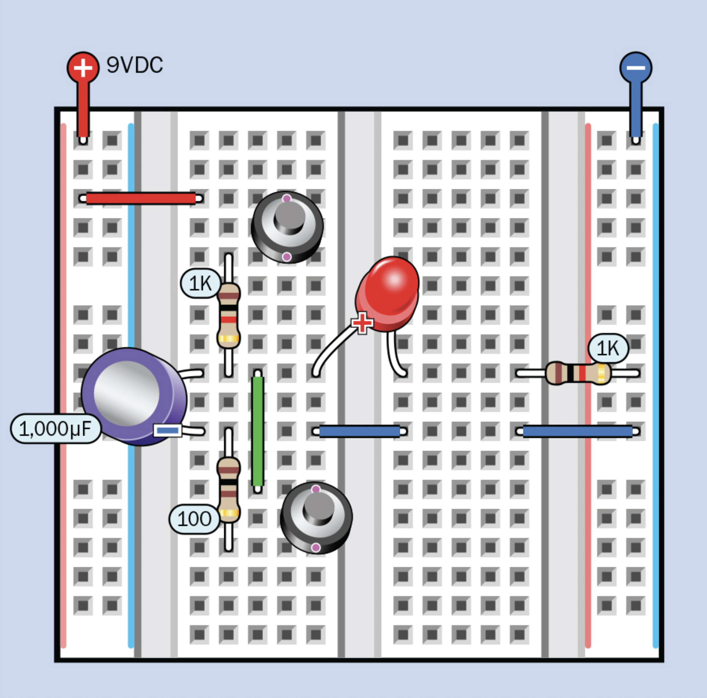

---

# Day 4 (6/26)

## Wave

- Integrated Circuits (IC)
- Oscillators
- Electronic sound circuits

---

# Day 5 (6/29)

## Control

- Intro to microcontrollers (Micro:bit)
- Programming + hardware integration

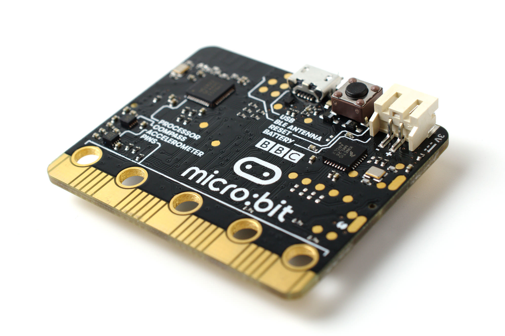

---

# Day 6 (6/30)

## Join

- Soldering (Weevil)
- Moving from breadboard to permanent builds

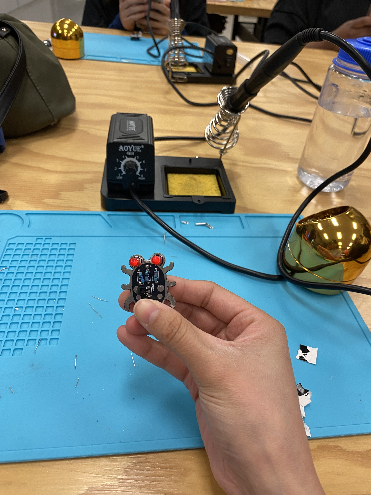

---

# Day 7 (7/1)

## Create

- Prototyping
- Putting it all together
- Wrap-up and next steps

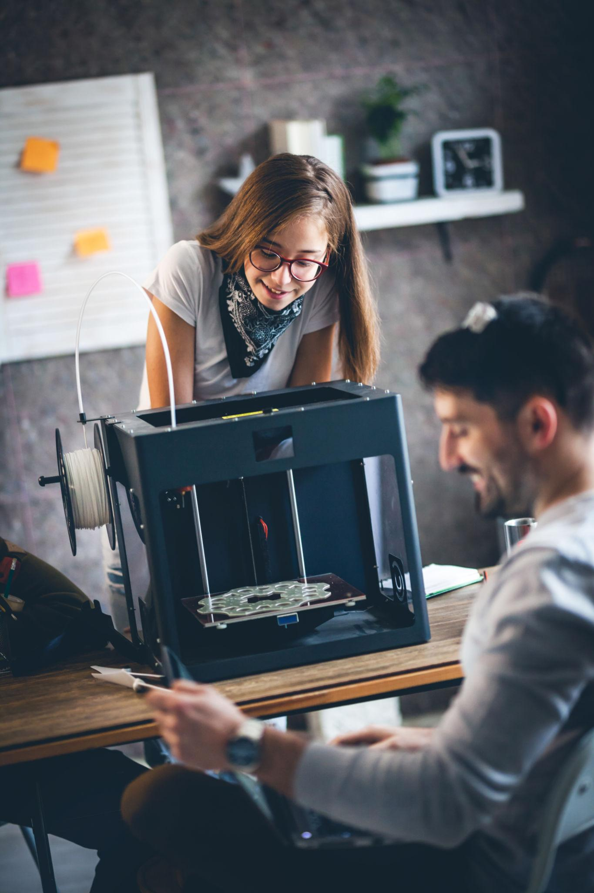

---

# Afternoon Sessions

Each day:

- Reflect on student experience
- Adapt lessons to your classroom

---

# Expectations

- Ask questions
- Experiment freely
- Embrace mistakes
- Collaborate

---

# Some Homework

- Read [*Make: Electronics* (Charles Platt)](https://electricalconnects.com/frontend/images/free_items/make-electronics-second-edition-by-charles-platt.pdf)
- Sign up for [Tinkercad](https://www.tinkercad.com)

---

# Join the Chat 💬

<https://discord.gg/pBPrXzp8W>

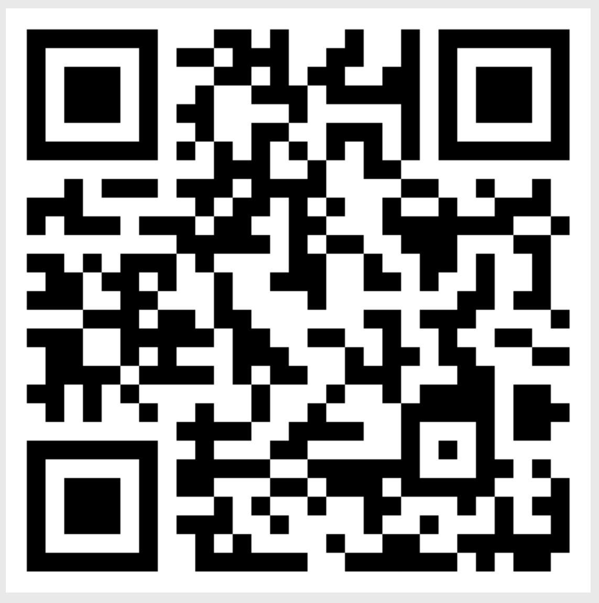

---

# Questions?
