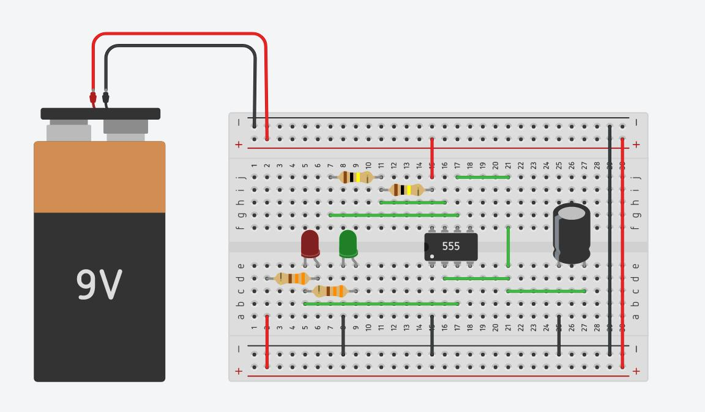

# Summer CS Hardware Intensive  
### Info Session  
**Ian Heraty**

---

# Welcome 👋

- 7-day summer intensive
- Focus: **Computer Hardware + Electronics**
- Designed for **high school**
- Hands-on, project-based learning

---

# Quick Question

## What do you hope to get out of this intensive?

- Learn electronics fundamentals?
- Build confidence with hardware?
- Bring projects into your classroom?
- Something else?

---

# Structure of Each Day

**Morning (8:30 – 12:00)**
*Co-learning with students*
- Lecture
- Hands-on projects

**Lunch (12:00 – 1:00)**

**Afternoon (1:00 – 2:00)**
*Educators*
- Reflection + pedagogy
- Adapting for your classroom

---

# Pedagogical Approach

- Learning by **discovery**
- Build intuition through **hands-on projects**

---

# Core Goal

> Bootstrapping students (and teachers) with hardware knowledge from **Ohm's Law → Microcontrollers**

---

# Why Hardware?

- Growing importance in STEM
- Bridges:
  - Computer Science
  - Electrical Engineering
  - Computer Engineering
  - Physics

---

# Why Now?

- **The shift is happening:** Software → **Software + Hardware**
- AI writes code → but struggles with the physical world
- Hardware is becoming a bottleneck

---

> "Over the next 25 years, most of the money will be made in hardware"
> - Shaun Maguire, Partner, Sequoia
> [Source](https://x.com/tbpn/status/2042981124641820943?s=20)

---

> "The biggest beneficiaries of vibecoding are going to be the shape rotators, not the wordcels."
> — Palmer Luckey, Founder, Oculus + Anduril
> [Source](https://x.com/a16z/status/2026348550477722020?s=20)

---

# What hardware gives you as an *educator*

- Deeper intuition (how systems actually work)  
- Tangible results (light, sound, motion)  
- Engaging learning for students
- Lifelong skill

---

# Learning Goals

- What is electricity?
- Voltage (V), Current (I), Resistance (R)
- Ohm's Law
- Breadboards & circuits
- Multimeter usage

---

# Components You'll Learn

- Resistors
- Capacitors
- Diodes
- Potentiometers
- Transistors

---

# Systems & Concepts

- Logic & Binary
- 555 Timer
- Decade Counters
- Signals & pulses

---

# Tools & Skills

- Microcontrollers
- Soldering
- CAD / 3D Design
- Bill of Materials (BOM)

---

# Equipment You'll Use

- Multimeter
- Breadboard
- Jumper wires
- Resistors, capacitors
- Switches, buttons
- Micro:bit
- Soldering iron

---

# Example Projects

- LED brightness control
- Variable resistance circuit
- LED delay + fade (RC circuit)
- Transistor toggle switch
- Multivibrator circuit
- 555 timer circuits

---

# Weekly Schedule Overview

### Day 1 (6/23)
- Electricity basics
- Ohm's Law
- Multimeter
- Breadboard + LED control

---

# Day 2 (6/24)

- Capacitors
- Buttons & switches
- RC circuits
- LED delay + fade

---

# Day 3 (6/25)

- Transistors
- Logic gates
- Multivibrator circuit
- Sound / speaker circuits

---

# Day 4 (6/26)

- Intro to microcontrollers (Micro:bit)

---

# Day 5 (6/29)

- Microcontroller projects
- Programming + hardware integration

---

# Day 6 (6/30)

- Soldering (Weevil)
- Moving from breadboard → permanent builds

---

# Day 7 (7/1)

- Tinkercad + 3D printing
- Final wrap-up

---

# Afternoon Sessions

Each day:

- Reflect on student experience
- Adapt lessons to your classroom

---

# Expectations

- Ask questions
- Experiment freely
- Embrace mistakes
- Collaborate

---

# Some Homework

- Read [*Make: Electronics* (Charles Platt)](https://electricalconnects.com/frontend/images/free_items/make-electronics-second-edition-by-charles-platt.pdf)
- Sign up for [Tinkercad](https://www.tinkercad.com)

---

# Questions?
